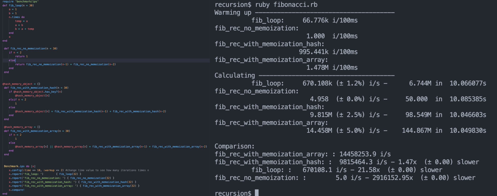

# Simple speed testing in Ruby using recursive solution

## About:
Testing the speed of recursive algorithm in ruby, Examples used: a simple countdown and fibonacci.

## How to use ?
- Downlaod/clone repo
- gem install benchmark-ips 
- Change values in the benchmark function to see different outputs
- To run just: ruby file.rb

## Images
Countdown example: How many iterations per second and how many in 10 seconds, using a time loop vs recursive algorithm.

Fibonnaci example: How many iterations per second and how many in 10 seconds, and 32 as fib secuence.
- Using a while loop
- Using recursive solution without memoization
- Recursive solution using memoization with an array
- Recursive solution memoization with a hash

