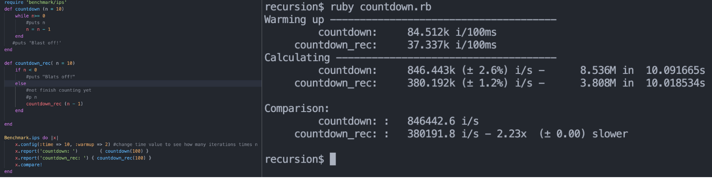

# Simple speed testing in Ruby Using recursivity

## About:
Testing the speed of recursivity  in ruby, Examples used: a simple countdown and fibonacci.

## How to use ?
- Downlaod/clone repo
- gem install benchmark-ips 
- Change values in the benchmark function to see different outputs
- To run just: ruby file.rb

## Images
Countdown example: How many iterations per second and how many in 10 seconds, using a time loop vs recursivity.

Fibonnaci example: How many iterations per second and how many in 10 seconds, and 32 as fib secuence.
- Using a while loop
- Using recursivity
- Recursivity using memoization with an array
- Recursivity using memoization with a hash

